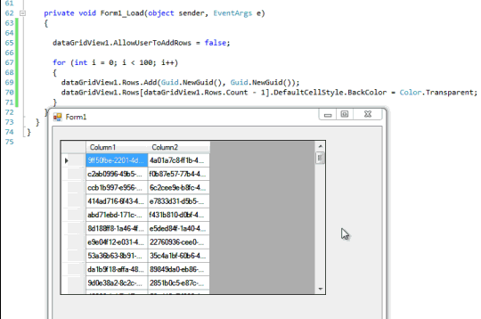

Поймал забавный момент, когда при переходе между вкладками, изображение содержимого вкладок накладывалось друг на друга. 


Странное поведение. 
Проблема была свойственна только **DataGridView**, остальные элементы вели себя как положено. 
При прокрутке списка, изображение размазывалось. 
Вывод окна за пределы видимой области экрана восстанавливал изображение в нормальный вид. 
Попробовал делать принудительную прорисовку на разных уровнях, но эффект оставался.

В итоге оказалось, что проблема в цвете фона строк **DataGridView**. 
В значениях по умолчанию был указан прозрачный цвет фона, что и приводило к подобному эффекту. 

Примечательно, что эффект наблюдается, когда значение свойства ``AllowUserToAddRows = false``.

Я не стал разбираться. Если это кого-то заинтересует, упрощённый пример ниже.

```C#
using System;
using System.Collections.Generic;
using System.ComponentModel;
using System.Data;
using System.Drawing;
using System.Linq;
using System.Text;
using System.Windows.Forms;

namespace WindowsFormsApplication14
{
  public partial class Form1 : Form
  {
    private System.Windows.Forms.DataGridView dataGridView1;
    private System.Windows.Forms.DataGridViewTextBoxColumn Column1;
    private System.Windows.Forms.DataGridViewTextBoxColumn Column2;

    public Form1()
    {
      InitializeComponent();

      this.dataGridView1 = new System.Windows.Forms.DataGridView();
      this.Column1 = new System.Windows.Forms.DataGridViewTextBoxColumn();
      this.Column2 = new System.Windows.Forms.DataGridViewTextBoxColumn();
      ((System.ComponentModel.ISupportInitialize)(this.dataGridView1)).BeginInit();
      this.SuspendLayout();
      // 
      // dataGridView1
      // 
      this.dataGridView1.ColumnHeadersHeightSizeMode = System.Windows.Forms.DataGridViewColumnHeadersHeightSizeMode.AutoSize;
      this.dataGridView1.Columns.AddRange(new System.Windows.Forms.DataGridViewColumn[] {
            this.Column1,
            this.Column2});
      this.dataGridView1.Location = new System.Drawing.Point(12, 22);
      this.dataGridView1.Name = "dataGridView1";
      this.dataGridView1.Size = new System.Drawing.Size(429, 250);
      this.dataGridView1.TabIndex = 0;
      // 
      // Column1
      // 
      this.Column1.HeaderText = "Column1";
      this.Column1.Name = "Column1";
      // 
      // Column2
      // 
      this.Column2.HeaderText = "Column2";
      this.Column2.Name = "Column2";
      // 
      // Form1
      // 
      this.AutoScaleDimensions = new System.Drawing.SizeF(6F, 13F);
      this.AutoScaleMode = System.Windows.Forms.AutoScaleMode.Font;
      this.ClientSize = new System.Drawing.Size(531, 374);
      this.Controls.Add(this.dataGridView1);
      this.Name = "Form1";
      this.Text = "Form1";
      this.Load += new System.EventHandler(this.Form1_Load);
      ((System.ComponentModel.ISupportInitialize)(this.dataGridView1)).EndInit();
      this.ResumeLayout(false);
    }

    private void Form1_Load(object sender, EventArgs e)
    {
      dataGridView1.AllowUserToAddRows = false; // // если поменять на true, то все будет нормально

      for (int i = 0; i < 100; i++)
      {
        dataGridView1.Rows.Add(Guid.NewGuid(), Guid.NewGuid());
        dataGridView1.Rows[dataGridView1.Rows.Count - 1].DefaultCellStyle.BackColor = Color.Transparent;
      }
    }
  }
}
```



___
_Алексей Немиро, 30.05.2015_