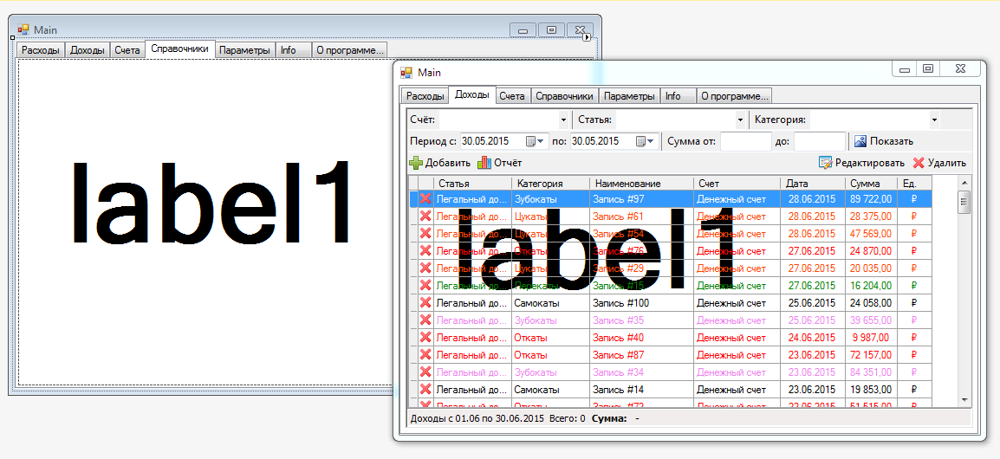

Поймал забавный момент, когда при переходе между вкладками, изображение содержимого вкладок накладывалось друг на друга. 

Странное поведение. 
Проблема была свойственна только **DataGridView**, остальные элементы вели себя как положено. 
При прокрутке списка, изображение размазывалось. 
Вывод окна за пределы видимой области экрана восстанавливал изображение в нормальный вид. 
Попробовал делать принудительную прорисовку на разных уровнях, но эффект оставался.

В итоге оказалось, что проблема в цвете фона строк **DataGridView**. 
В значениях по умолчанию был указан прозрачный цвет фона, что и приводило к подобному эффекту. 
___
_Алексей Немиро, 30.05.2015_